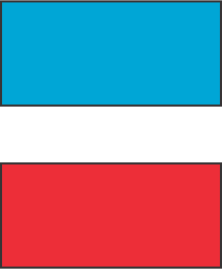

##  File - NoteForm_s.jsx -- Sample Site
 
###  -- overview --

The note form handles both create-new and edit-update functions.
 
It consists of 4 parts

- wysiwyg - content -  string of html
- catgory - string
- keyword - array of strings
- last edit date - in ISO format

 

Both the category and keywords have their own collections.
So both require a consistent input string structure ...
without white space and all lower case.  

Categories have the additional step of capitalizing 
the first workd in the string.

  

###  -- Form decompositions --
 

Logic used to submit the Noteform to the redux store.
Consists of 2 major actions :  
- new form
- submitted form

Handles create and updates for 3 collections
- notes
- categories
- keywords  

---

---

      1.  retrieve from Redux store - notes, categories, keywords           X
      2.  create form selector input options                                x
      3. fill the default values in form fields                             x
         based on whether new or edit

###  -- on Submit form --

      4.  retrieve and clean the form data                                  X
          a.  clean the category data                                       x
          b.  clean the keyword data                                        x

      5. Dispatch the note data to Redux store                              x
         a. if new - add to note collection                                 x
         b. if edit - update note in note collection                        x

      6. Update category collection
         
         a. check if category form data submitted is                        x
            different from default

          ... This section only executes if category has changed ...

              if new submitted category different from default

              first test if the defaultCategory was blank or prefilled
              if it was prefilled and will now be changed, - then 
              the noteHolderArray of the defaultCategory must remove
              the reference to the noteId
              

              if defaultCategory !== '' then -
                 b. find defaultCategory index and delete noteId form   
                    it's noteHolders array

              if default value is === '' then no delete execution

              c. check if category form data exists already or is new
              d. update category
                 if existant category - add noteId to noteHolders
                 if new category 
                    - add new category to Category collection
                      with noteId as first noteHolder in noteHolderArray

          ...                   .....                      ...
           if new submitted category the same as default
              do nothing           

      7. Update keyword collection
          a. check if keyword form data submitted is
            different from default

            if new submitted keyword array the same as default
               do nothing

            if new submitted keyword array different from defualt
               create array of new-different-keywords
               note:  These are the only keywords that have to be
               changed in database or store

              b.  find out which new-differnt-keywords exist or are new
                  next step is done with a map

                  - if new-differnt-keywords does NOT exist
                    c. add new-differnt-keyword  to keyword Collection with
                       noteId as only keywordHolder in Array

                  - if new-differnt-keyword exists 
                    d. uprdate new-differnt-keyword keywordNoteholder
                       with noteId
                
                   
      

